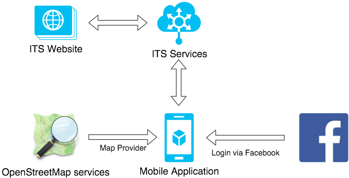
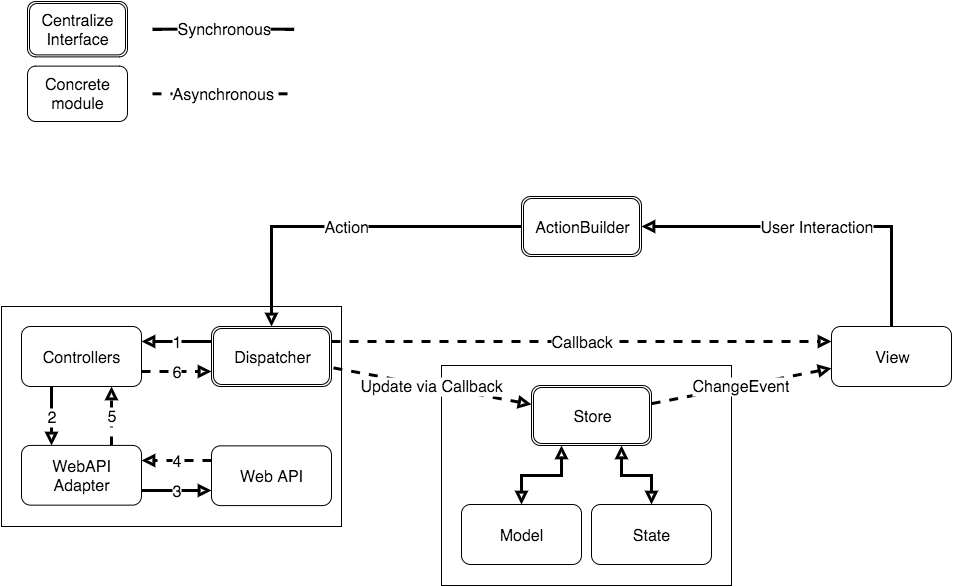

# The TripMaester - ITS Android Architect #

## Introduction ##

These documents describe about the ITS Android Application:

* [Usecases](usecases.md)
* [Package Structure](PackageStructure.md)
* [HTTP Server API](ServerApiDocumentation.md)

In this document, we talk about the Trip Maester Android Application (TM) and it's architect.

## Application components 

The system can be described as below

The system includes following modules:

* **ITS-Web services**: Provide the core ITS services, which are trip services, finding services, social services...
* **OpenStreetMap**: This OSM provide map render services. The locations is provided by ITS services and will be displayed on OpenStreetMap
* **Facebook**: will provide social and login services the system
* **ITS Website**: This is the ITS website.

From now on, we only focus about the Trip Maester Android Mobile Application (TM). Other 3rd party services that TM uses:

* [Crashlytics](https://www.crashlytics.com/): Lightest weight crash reporting solution.
* [Google analytics](https://www.google.com/analytics/): Collecting usage analytics.

## TripMaester architect

TM architect is based on the new [Facebook flux](https://facebook.github.io/flux/docs/overview.html) architect.

### Flux architect

The following diagram describes the data flow in Flux. The dispatcher, stores and views are independent nodes with distinct inputs and outputs.

The views may cause a new action to be propagated through the system in response to user interactions:

Flux key features:

* The data flows is always **unidirectional**.
* Application divided into three main parts:
    * **View**: User Interface
    * **Dispatcher**: Central hub which pass actions to the corresponding stores.
    * **Stores**: State of application domain. Stores can excute some the bussiness logic and produce event to update interface.
    * **Action** is a plain object that carries the data of a specific action

#### Flux vs MVC

Note: Most of this part is copied from this [blog](https://medium.com/hacking-and-gonzo/flux-vs-mvc-design-patterns-57b28c0f71b7#.igeus6ppl).

**Model - View - Controller** is the well-known architect for the system. In general most MVC patterns considers three roles: 

> * **Model**: manages the behavior and data of the application domain
> * **View**: represents the display of the model in the UI
> * **Controller**: takes user input, manipulates the model and causes the view to update

The core ideas of MVC can be formulated as following:

> * Separating the presentation from the model:
> * Enables implementation of different UIs and better testability
> * Separating the controller from the view:
> * Most useful with web interfaces and not commonly used in most GUI frameworks

The problems on MVC architect:

* MVC did not scale well, as Facebook claimed in their [post](http://facebook.github.io/flux/docs/overview.html#content) due to bidirectional communication problem.
* One change can loop back and have cascading effects across the codebase.
	
The Flux approach that fixes above problems: By forcing an unidirectional flow of data between a system’s components.

### TripMaester implementation

The TripMaester architect describe as the following diagram. It is a little bit different from the original Flux architect to reduce boilerplate code.

#### The component mapping

* **View**: Activity or Fragment... View binding some UI data validation.
* **ActionBuilder**: There are 2 kinds of Action
    * *AsyncAction*: will be processed in async controller. Such as: HTTP requests, background request...
    * *StateAction*: this is action that change the application state. Thus it will be dispatched to **Store** immedieately.
* **Dispatcher**: We create a centralize dispatcher which are more power.
    * *Dispatch Request*: Dispatcher that will dispatch the **Actions** to corresponding *Controller* or **Store** based on Action type.
    * *Dispatch Result*: There are 2 components can receive the results
        * The original *View* if they register callback via ActionBuilder.
        * The **Store** if Store need to process data and updates state.
* **Store**: Store processes plain data or updates application state. Then, Store raise *changed event* to registered **View**. Store also provides some bussiness functions but does not modify the data by itself. 

#### Usage

##### Example 1: Simple request and receive callback on view

Usecase: User click on button find list nearby friends.

Preprocess:

* None.

Flow:

* **View** received the *onClick* event. It created a *ActionLocationNearbyFriends* via **ActionBuilder** and registered the callback in created action.
* The action will be posted into **Dispatcher**. 
    * Dispatcher dilivers action to *LocationController* and will be processed there.
    * When the *LocationController* finishes it work in asynchronous threads, the result data will be posted back to dispatcher.
    * Dispatcher will update the view via callback set in *ActionLocationNearbyFriends*
* View updates UI.

##### Example 2: Nofication updates Store and multiple views

Usecase: A notification received: there is new comment on a trip. 

Preprocess:

* Store registered event *ActionTripGetNewComment* from **Dispatcher**.
* Activities/Fragments registered events from **Store**.

Flow:

* A *NotificationReceiver* receive a new pushed message. It builds an **Action** *ActionTripGetNewComment*
* The **Action** is dilivered to **Dispatcher**
    * Dispatcher handled action to *TripController* and will be processed there.
    * When the *TripController* finishes it work in asynchronous threads, the result data will be posted back to dispatcher.
    * Dispatcher give the result to the **Store** via callback.
* **Store**, based on its registered callbacks, raise various update events
    * *NewNotification*
    * *NewTripComment*
* **Views**:
    * *LeftNavigationDrawerMenuFragment* updates the number of new notifications. To get the number of new notification, the Fragment need to call the **Store** interface.
    * *MapFragment* updates the number of new notifications on search bar if it is visible.
    * *TripCommentFragment* updates the comment conservation if current conversation is diplayed.
  
Note:

  * When View (*TripCommentFragment*) detects the comment is read, it will create another Action and post to Dispatcher. Then, View only refects what Store data are.

##### Example 3: Application State changed

Usecase: User changed the transportation method.

Preprocess:

* Store registered event *ActionRouteTransportationChanged* from **Dispatcher**.
* Activities/Fragments registered events from **Store**.

Flow:

* **View** received the *onClick* event. It created a *ActionRouteTransportationChanged* via **ActionBuilder** (does not registered the callback in created action).
* The **Action** is dilivered to **Dispatcher**
    * Dispatcher bypass give the event to the **Store** via callback, due to this is a *StateAction*.
* **Store**, based on its registered callbacks, raise various update events
    * *NewConfiguration*
* **Views**:
    * *LeftNavigationDrawerMenuFragment* updates the corresponding selection
    * *MapFragment* updates the displayed layers.

